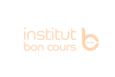

# BonCours

---

Créé avec soin par **Dubos Web Services** (https://www.duboswebservices.fr)



---

## 🚀 Technologies utilisées

- React avec Vite (create vite@latest)
- Dépendances : react-router-dom, framer-motion, react-icons, smooth-scroll

## 📁 Structure du projet

```
src/
  components/
    Header/
    Footer/
    Home/
      Banner/
  pages/
    Home/
    About/
    Contact/
    Error/
```

## 🧩 Composants

- **Header** : Barre de navigation moderne et responsive avec menu burger
- **Footer** : Pied de page complet avec liens sociaux et vers le site web
- **Home** : Page d’accueil intégrant un Banner animé
- **Banner** : Section d’accueil animée avec framer-motion

## ⚙️ Lancement du projet

Un terminal s’ouvre automatiquement pour lancer la commande suivante dans le dossier frontend :

```
npm run dev
```

## 🔧 Backend optionnel

Un backend Express minimal est créé si demandé, dans `backend/`.

## 📞 Contact Dubos Web Services

- Site : https://www.duboswebservices.fr
- Email : contact@duboswebservices.fr

---

**Merci d'utiliser ce générateur de projets React moderne.**

# Bon-Cours
